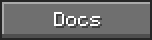
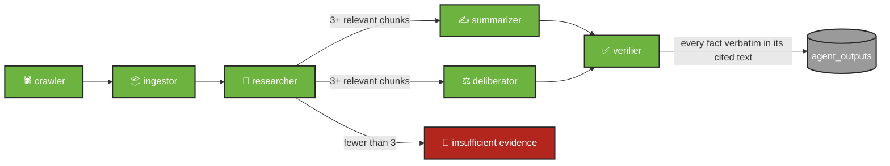
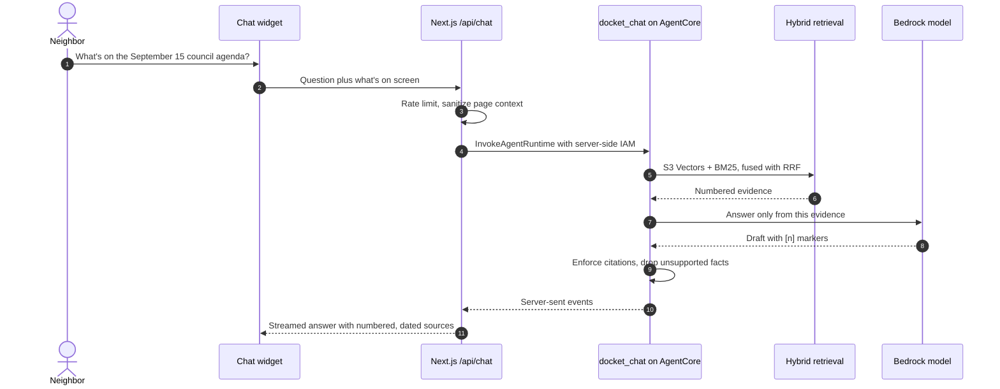
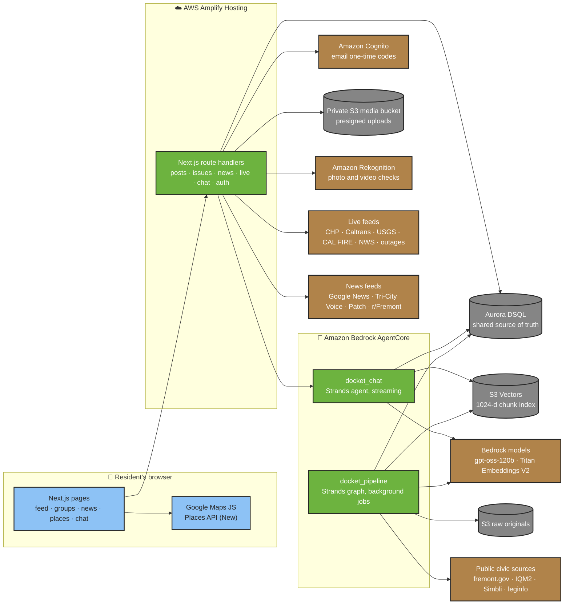

<!--
  Images in docs/readme/ are drawn by docs/readme/build.mjs. Edit the script, then run:
  node docs/readme/build.mjs
-->

<div align="center">



### The neighborhood app for Fremont, California.<br>With an AI agent that reads city hall, so your block doesn't have to.

<a href="https://k1lst1x.github.io/DOCKET/"></a>
<a href="#features"></a>
<a href="#how-it-works"></a>
<a href="#architecture"></a>
<a href="#quick-start"></a>
<a href="#docs"></a>

<br><br>

<a href="https://github.com/k1lst1x/DOCKET/actions/workflows/ci.yml"></a>
<a href="https://k1lst1x.github.io/DOCKET/"></a>
<a href="LICENSE"></a>


<br><br>



<sub>▲ Nine slots, one neighborhood. The selector cycles through everything Docket does.</sub>

</div>

<br>

> [!NOTE]
> The [GitHub Pages preview](https://k1lst1x.github.io/DOCKET/) is a static export of the real frontend. It has no server, so sign-in, posting, votes and chat are switched off there. Groups, agenda items, posts and votes that the live agent hasn't produced yet are labelled **sample data** in the app.

<details>
<summary><b>📜 Table of contents</b></summary>

<br>

| | | |
| --- | --- | --- |
| 🟩 [What is Docket?](#what-is-docket) | 🎒 [Features](#features) | ⛏️ [How it works](#how-it-works) |
| 🗺️ [Architecture](#architecture) | 🧭 [Sources](#sources) | 🛡️ [Trust and safety](#trust-and-safety) |
| 🏆 [Evals](#evals) | 🧰 [Tech stack](#tech-stack) | 🚀 [Quick start](#quick-start) |
| 🧪 [Checks and CI](#checks-and-ci) | 📦 [Deployment](#deployment) | 🗂️ [Project layout](#project-layout) |
| 🧱 [Routes and API](#routes-and-api) | 🗺️ [Roadmap](#roadmap) | 📚 [Docs](#docs) |
| 👥 [Contributors](#contributors) | | |

</details>


<a id="what-is-docket"></a>

## 🟩 What is Docket?

Keeping up with your own street shouldn't be a part-time job. In Fremont, city decisions hide in agenda packets and meeting minutes. Road closures, fires and outages sit on state and federal feeds. Local stories are spread across several news sites, and neighbors talk in group chats. By the time it all adds up, the meeting is over.

**Docket puts the whole neighborhood in one place.** Neighbors post and talk in a feed. News, live incidents and places are sorted for each of Fremont's 32 official neighborhoods. Behind it all, an AI agent built with [Strands Agents](https://strandsagents.com) on Amazon Bedrock AgentCore reads the public record in the background and turns it into short updates. Every claim in those updates cites its source.

<table>
<tr>
<th width="50%">😩 Without Docket</th>
<th width="50%">😎 With Docket</th>
</tr>
<tr>
<td>

- Check city sites, news sites and alert feeds one by one
- Dig through a 300-page agenda packet to find one item
- Hear about the rezoning, or the road closure, after the fact
- Guess which neighbors care

</td>
<td>

- One feed for your neighbors and your neighborhood
- News, incidents and city hall, filtered to your area
- Plain summaries with numbered sources, before the deadline
- Community votes and reviews on every local issue

</td>
</tr>
</table>


<a id="features"></a>

## 🎒 Features

<table>
<tr>
<td width="33%" valign="top">
<br>
<b>Neighborhood feed</b> · <code>/app</code><br>
<sub>Post to your neighborhood or all of Fremont. Up to four photos or one short video, links and emoji. Reply, like, and see a <i>Show N new posts</i> button as neighbors write.</sub>
</td>
<td width="33%" valign="top">
<br>
<b>Neighborhood groups</b> · <code>/groups</code><br>
<sub>Type an address or cross street and Docket matches it to one of 32 official neighborhoods. Join with a 6-digit email code, no password, and see what the group is watching.</sub>
</td>
<td width="33%" valign="top">
<br>
<b>Places map</b> · <code>/places</code><br>
<sub>Google Maps with neighborhood outlines, category filters, search suggestions sorted nearest first, and detail cards with photos, hours, ratings and websites.</sub>
</td>
</tr>
<tr>
<td valign="top">
<br>
<b>Fremont news</b> · <code>/news</code><br>
<sub>City hall, police, fire, housing and traffic stories, searchable and filterable by neighborhood, topic, type, source and time. Filters live in the URL; new stories are marked as they arrive.</sub>
</td>
<td valign="top">
<br>
<b>Live incidents</b> · <code>/places</code><br>
<sub>CHP calls, Caltrans lane closures, earthquakes, CAL FIRE incidents, power outages and National Weather Service alerts, refreshed every minute and pinned on the map.</sub>
</td>
<td valign="top">
<br>
<b>Community votes</b> · <code>/g/[slug]</code><br>
<sub>Open an issue to see its deadline, AI pros and cons tagged <i>source</i> or <i>inference</i> with citations, stance polls with charts, and neighbor reviews (vote first, then review).</sub>
</td>
</tr>
<tr>
<td valign="top">
<br>
<b>Ask Docket</b> · <code>/chat</code> + everywhere<br>
<sub>A chat bubble on every page, even over popups. It knows what you're looking at, streams answers about Fremont with numbered sources, and says so when its sources don't cover a question.</sub>
</td>
<td valign="top">
<br>
<b>City hall, read for you</b> · agent<br>
<sub>Council and planning agendas, minutes, staff reports, school board meetings, resident service requests and state bills, ingested politely and turned into verified, cited updates.</sub>
</td>
<td valign="top">
<br>
<b>Safe to share</b> · everywhere<br>
<sub>Posts, reviews and names pass a disguise-proof language filter. Photos and videos pass file-signature checks and Amazon Rekognition before any neighbor sees them.</sub>
</td>
</tr>
</table>


<a id="how-it-works"></a>

## ⛏️ How it works

<div align="center">

</div>

Docket has **two Strands agents**, each deployed as its own Amazon Bedrock AgentCore runtime, plus the Next.js app residents use.

### 🛤️ `docket_pipeline`: the reading agent

A Strands `GraphBuilder` graph ([`backend/core/generation_graph.py`](backend/core/generation_graph.py)) that runs as a background job:

| Station | What happens |
| --- | --- |
| 🕷️ **Crawl** | Reads the [source registry](backend/config/sources.yaml), checks robots.txt (RFC 9309), waits at least `max(0.5 s, crawl-delay)` per host, and discovers documents one level deep. Firecrawl runs in basic proxy mode only, never stealth. |
| 📦 **Ingest** | Extracts text (Firecrawl markdown, PDF pages with `p. N › section` locators, or trafilatura), splits it into ~700-token chunks on headings and agenda items, embeds them with Titan Text Embeddings V2 (1024 dimensions), and stores the raw original in S3. Content hashes make reruns idempotent. |
| 🔎 **Research** | Hybrid retrieval: S3 Vectors cosine search plus BM25 keyword search, fused with reciprocal rank fusion. The evidence is recorded exactly as the tools return it. |
| ✍️ **Write** | A summarizer and a deliberator (pros and cons) return structured output that cites evidence numbers. With fewer than 3 relevant chunks, the graph routes to `insufficient_evidence` instead. |
| ✅ **Verify** | An LLM verifier judges each claim against the text it cites, **and** code independently requires every strong fact (dollar amounts, dates, sections, record IDs, addresses) to appear verbatim in that text. |
| 📣 **Publish** | Only claims that pass both checks reach `agent_outputs`, linked to their chunks. |



### 💬 `docket_chat`: the answering agent



- **Grounded or it refuses.** Questions about Fremont or government must be answered with citations. When the evidence doesn't cover them, Docket says so and lists the sources it searched.
- **Small talk is allowed.** Greetings and general questions get a plain answer, marked as not grounded, with no citations.
- **Context-aware.** Pages, selected items and open popups register what's on screen, and the chat widget portals itself into open dialogs so it's always reachable.
- **Memory.** Conversation history is stored in Aurora DSQL and bound to the signed-in user.


<a id="architecture"></a>

## 🗺️ Architecture



**Boundaries that matter**

- 🔐 The browser never receives AWS credentials. The Next.js server reaches DSQL, S3, Rekognition and AgentCore with its compute role, and invokes the chat runtime server-side.
- 🧱 Aurora DSQL is the shared source of truth. The **web app** owns neighborhoods, groups, issues, polls, members, memberships, votes, reviews, posts, likes and media reviews ([`frontend/db/migrations`](frontend/db/migrations)). The **agent** owns `agent_*` tables for sources, documents, chunks, outputs, claims, chat sessions and runs ([`backend/migrations`](backend/migrations)).
- 🎟️ The pipeline runs in its own runtime with its own least-privilege IAM policy ([`backend/agentcore/policies`](backend/agentcore/policies)). Its Firecrawl key lives in AWS Secrets Manager.
- 💸 Serverless all the way down (DSQL, S3 Vectors, Cognito Essentials, AgentCore), sized to run on a few dollars a month.

More detail: [architecture notes](docs/architecture.md) · [architecture diagram](docs/architecture.svg).


<a id="sources"></a>

## 🧭 Sources

<details open>
<summary><b>📜 Public records the agent reads</b> (<a href="backend/config/sources.yaml"><code>backend/config/sources.yaml</code></a>)</summary>

<br>

| Source | Kind | Schedule |
| --- | --- | --- |
| City of Fremont meeting portal (IQM2): agendas and agenda packets | meetings | weekly |
| Fremont Agenda Center: City Council meetings and minutes | meetings | weekly |
| Fremont Agenda Center: Planning Commission | zoning | weekly |
| City of Fremont news | news | daily |
| Fremont App (CitySourced): resident service requests | resident issues | daily |
| Fremont Transportation Engineering: plans and projects | transportation | weekly |
| Fremont Unified School District Board of Education (Simbli) | schools | weekly |
| California Legislature daily change files (bills by Fremont's legislators or mentioning Fremont) | state legislation | daily |
| California State Assembly and Senate members by district | reference | monthly |
| Fremont Neighborhoods GIS layer (32 official areas) | reference | monthly |

Every URL was fetched and its robots.txt checked before it went in the registry. Legislators are resolved from official pages at run time, never from model knowledge.

</details>

<details>
<summary><b>🚨 Live incident feeds</b> (<a href="frontend/src/lib/live"><code>frontend/src/lib/live</code></a>)</summary>

<br>

| Feed | What Docket keeps |
| --- | --- |
| CHP statewide CAD log | Incidents inside Fremont's bounds |
| Caltrans District 4 lane closures | Closures near Fremont |
| USGS earthquakes | M2.5+ within 150 km, or any quake within 40 km, last 48 hours |
| CAL FIRE incidents | Fires within 200 km |
| California power outages (ArcGIS) | Outages near Fremont |
| National Weather Service | Alerts for Fremont's forecast zone and Alameda County |

Each feed is cached on the server on its own schedule (60 seconds or 5 minutes). When a feed fails, the last good data stays up.

</details>

<details>
<summary><b>🗞️ News feeds</b> (<a href="frontend/src/lib/news"><code>frontend/src/lib/news</code></a>)</summary>

<br>

- Google News searches for each neighborhood's names, plus shared topics: police and crime, fires and disasters, housing, city hall
- Tri-City Voice and Patch Fremont
- r/Fremont posts that name a neighborhood
- Nearby live incidents and weather alerts

Relevance filters learned from real headlines: stories must actually be about Fremont, same-name towns elsewhere (Niles, Ohio; Centerville, Utah; Warm Springs, Oregon) are dropped, and so are press-release and law-firm spam.

</details>


<a id="trust-and-safety"></a>

## 🛡️ Trust and safety

| | Promise | How it's enforced |
| :-: | --- | --- |
| § | **Every claim links to the record** | Answers and summaries carry numbered citations with dates. Code checks that facts appear verbatim in the cited text and removes padding citations that don't support their sentence. |
| ✓ | **Neighbors' votes are opinions** | Community polls are always shown as resident opinion, never as official council votes. |
| # | **Sample data says so** | Seeded groups, issues, posts and votes carry `is_sample` and a visible label. |
| ! | **Checked before neighbors see it** | Text goes through [`moderation.ts`](frontend/src/lib/moderation.ts): Unicode normalization, look-alike letters, leetspeak, masked letters (`s*x`, `4uck`) and spaced-out words, without blocking phrases like "sex offender registry". Uploads go through [`media-moderation.ts`](frontend/src/lib/media-moderation.ts): the first bytes must match the declared file type, photos run through Rekognition moderation labels **and** text detection, and videos through an async moderation job. |
| 🔒 | **Fail closed** | A file Rekognition can't read is never shown. Photos and videos are served only through short-lived signed links from a private bucket. |
| 🤖 | **Polite crawler** | Honors robots.txt and crawl delays, identifies itself where allowed, and never uses stealth proxies. |
| 🎫 | **Server-side secrets** | Group and role always come from the URL or the session, never the request body. Sessions are signed httpOnly cookies. Chat, auth and posting are rate limited. |


<a id="evals"></a>

## 🏆 Evals

<div align="center">

</div>

The groundedness suite ([`backend/evals/groundedness.py`](backend/evals/groundedness.py)) asks 20 answerable questions about real Fremont records and 5 questions the corpus can't answer. Model: `openai.gpt-oss-120b` with Titan Text Embeddings V2.

| Metric | Result | |
| --- | :-: | --- |
| Retrieval hit rate | **20 / 20** | 🟩🟩🟩🟩🟩🟩🟩🟩🟩🟩 |
| Answered | **19 / 20** | 🟩🟩🟩🟩🟩🟩🟩🟩🟩⬛ |
| Citation validity | **19 / 20** | 🟩🟩🟩🟩🟩🟩🟩🟩🟩⬛ |
| Cited the expected evidence | **18 / 20** | 🟩🟩🟩🟩🟩🟩🟩🟩🟩⬛ |
| Correct refusals | **5 / 5** | 🟩🟩🟩🟩🟩🟩🟩🟩🟩🟩 |

<details>
<summary>Sample answers from the run</summary>

<br>

> **Q:** Which site did the City Council rezone from Regional Commercial to Tech Industrial in July 2026?<br>
> **A:** The City Council rezoned the 11.21-acre site at 43800 Osgood Road from Regional Commercial (C-R) to Tech Industrial (I-T) in July 2026 [1].

> **Q:** How many units, and how many affordable units, were in the residential project the Planning Commission approved?<br>
> **A:** The Planning Commission approved a discretionary design-review permit for a residential project of 140 units, of which 21 units are on-site affordable units [1].

> **Q:** What is the population of Fremont, California?<br>
> **A:** I don't have anything in my sources about that. *(Correct: the corpus holds city records, not census data.)*

</details>

Full question-by-question results: [`backend/docs/eval-results.md`](backend/docs/eval-results.md).


<a id="tech-stack"></a>

## 🧰 Tech stack

| Slot | Item | Used for |
| --- | --- | --- |
| 🖥️ | **Next.js 15.5** (App Router), **React 19.3**, **TypeScript 5.9**, **Tailwind 3.4** | Web app, server route handlers, pixel-art scenes |
| 🐍 | **Python 3.11**, **FastAPI**, **uv** | Agent backend and local API fallback |
| 🧠 | **Strands Agents 1.55** on **Amazon Bedrock AgentCore** | Pipeline graph and chat agent runtimes |
| 🤖 | **Amazon Bedrock**: `gpt-oss-120b`, Titan Text Embeddings V2 | Generation, verification, 1024-d embeddings |
| 🗄️ | **Aurora DSQL** with IAM auth | App data, agent documents, chunks, outputs, chat history |
| 🧲 | **Amazon S3 Vectors** + BM25 (`rank-bm25`) | Hybrid retrieval |
| 🪣 | **Amazon S3** | Raw source originals, feed photos and videos |
| 🔑 | **Amazon Cognito** (Essentials) + SES | Passwordless email one-time codes |
| 🛡️ | **Amazon Rekognition** | Photo and video moderation |
| 🕸️ | **Firecrawl**, trafilatura, pypdf | Polite fetching and text extraction |
| 🗺️ | **Google Maps JavaScript API** + **Places API (New)** | Places map, search, address autocomplete |
| 🌎 | **US Census geocoder** | Address to neighborhood matching |
| ☁️ | **AWS Amplify Hosting**, **AWS CDK**, **GitHub Pages** | Hosting, runtime infrastructure, static preview |
| 🧪 | **Vitest**, **ESLint**, `unittest`, **GitHub Actions**, **Dependabot** | Tests, linting and CI |


<a id="quick-start"></a>

## 🚀 Quick start

**You'll need** Node.js 24 (see [`frontend/.nvmrc`](frontend/.nvmrc)), [uv](https://docs.astral.sh/uv/getting-started/installation/) (it can install Python 3.11 for you) and, for the live data paths, an AWS account in `us-west-2`.

### 🖥️ Frontend

```bash
cd frontend
npm ci
cp .env.example .env.local
npm run dev
```

Open http://localhost:3000. The UI works on its own with sample data; sign-in, posting, votes and chat need the AWS values below.

<details>
<summary><b>⚙️ Frontend environment</b> (<code>frontend/.env.local</code>)</summary>

<br>

| Variable | Purpose |
| --- | --- |
| `DEMO` | `1` shows the "sign in as" account switcher |
| `SESSION_SECRET` | Signs session cookies (32+ random characters) |
| `APP_URL` | Absolute origin of the site |
| `DSQL_ENDPOINT`, `DSQL_USER` | Aurora DSQL cluster and role |
| `COGNITO_USER_POOL_ID`, `COGNITO_CLIENT_ID` | Email one-time code sign-in |
| `DOCKET_MEDIA_BUCKET` | Private S3 bucket for feed photos and videos (text-only posts without it) |
| `DOCKET_CHAT_RUNTIME_ARN` | Deployed `docket_chat` AgentCore runtime |
| `DOCKET_CHAT_URL` | Local fallback, e.g. `http://localhost:8000/chat` |
| `NEXT_PUBLIC_GOOGLE_MAPS_API_KEY` | Browser key restricted by HTTP referrer (Maps JS + Places API (New)) |
| `NEXT_PUBLIC_GOOGLE_MAPS_MAP_ID` | Map ID for advanced markers (falls back to `DEMO_MAP_ID`) |

</details>

<details>
<summary><b>🧱 Provision AWS resources</b></summary>

<br>

```bash
cd frontend
bash scripts/aws-provision.sh          # Cognito user pool and app client, IDs written to .env.local
bash scripts/aws-media-bucket.sh       # private S3 bucket for feed media
bash scripts/aws-media-moderation.sh   # Rekognition permissions for the local dev user
bash scripts/aws-dev-user.sh           # least-privilege IAM user for the dev server
node scripts/dsql-migrate.mjs          # apply db/migrations to Aurora DSQL
node scripts/dsql-seed.ts              # 32 neighborhoods, sample groups, issues, posts and votes
```

</details>

### 🐍 Backend

```bash
cd backend
uv sync --locked
cp .env.example .env
uv run uvicorn api.main:app --reload --port 8000
```

- Health: http://localhost:8000/health
- Interactive API docs: http://localhost:8000/docs

<details>
<summary><b>⚙️ Backend environment</b> (<code>backend/.env</code>)</summary>

<br>

| Variable | Purpose |
| --- | --- |
| `AWS_PROFILE` or `AWS_ACCESS_KEY_ID` / `AWS_SECRET_ACCESS_KEY` | Credentials (blank if the AWS CLI is configured) |
| `AWS_REGION` | `us-west-2` |
| `BEDROCK_MODEL_ID` | `openai.gpt-oss-120b-1:0` |
| `EMBED_MODEL_ID` | `amazon.titan-embed-text-v2:0` |
| `DSQL_ENDPOINT` | Aurora DSQL cluster endpoint (IAM auth, no password) |
| `S3_VECTORS_BUCKET`, `S3_VECTORS_INDEX` | Vector bucket and index (1024 dimensions, cosine) |
| `S3_BUCKET` | Raw HTML and PDF originals |
| `FIRECRAWL_API_KEY` | Fetching fremont.gov and FUSD pages |
| `LOCAL` | `1` runs everything in-process without AgentCore |
| `DOCKET_PIPELINE_API_TOKEN` | Bearer token for `POST /generate` and `POST /ingest/run` |

</details>

<details>
<summary><b>🛤️ Run the pipeline and chat from the command line</b></summary>

<br>

```bash
cd backend
uv run python scripts/migrate.py        # apply agent_* migrations
uv run python scripts/ingest.py         # crawl, extract, chunk, embed and store
uv run python scripts/step4_search.py   # try hybrid retrieval
uv run python scripts/step5_chat.py     # ask the chat agent a question
uv run python scripts/step6_generate.py # generate a verified summary or pros and cons
uv run python evals/groundedness.py     # rerun the evals
```

</details>

To answer from the real corpus locally, point the frontend at the backend with `DOCKET_CHAT_URL=http://localhost:8000/chat` in `frontend/.env.local`.


<a id="checks-and-ci"></a>

## 🧪 Checks and CI

```bash
# backend/
uv run python -m unittest discover -s tests
uv run python -m compileall -q api core agentcore_chat.py agentcore_pipeline.py

# frontend/
npm run lint
npm run typecheck
npm run test
npm run build
npm run build:pages   # static GitHub Pages export
```

The [CI workflow](.github/workflows/ci.yml) runs on every push and pull request. New runs cancel stale ones for the same branch, and each job has a 10-minute timeout.

| Job | Steps |
| --- | --- |
| **Backend checks** | `uv sync --locked`, unit tests, compile check, AgentCore CDK build, test and format check, FastAPI and Strands smoke test (the pipeline API must reject unauthenticated calls) |
| **Frontend checks** | `npm ci`, ESLint with zero warnings, Vitest, production build, Pages export |
| **Deploy GitHub Pages** | Publishes the static preview from `main` after both checks pass |
| **Verify deployed Pages site** | Fetches the live preview and checks the home page rendered |

Agent tests mock the expensive graph and ingestion calls, so CI needs no API keys or AWS credentials.


<a id="deployment"></a>

## 📦 Deployment

| Piece | Where | How |
| --- | --- | --- |
| 🖥️ Web app | **AWS Amplify Hosting** | [`amplify.yml`](amplify.yml) builds `frontend/` on push to `main` and copies the server's environment into `.env.production`. The app is server-rendered (route handlers, cookies, request-time lookups), so it isn't a static export. |
| 🤖 Agents | **Amazon Bedrock AgentCore** | Both runtimes deploy with the AgentCore CLI and CDK from `backend/`. Step by step: [AgentCore hosting guide](backend/docs/agentcore-hosting.md). |
| 👀 Preview | **GitHub Pages** | [`scripts/build-pages.mjs`](frontend/scripts/build-pages.mjs) exports the real frontend with server-only routes swapped for browser fallbacks. Live incidents from USGS, NWS and outages load straight from the browser there. |


<a id="project-layout"></a>

## 🗂️ Project layout

```text
DOCKET/
├── backend/                     🐍 Python agent system (Strands + AgentCore)
│   ├── agentcore/               AgentCore project, CDK stack, IAM policies
│   ├── agentcore_chat.py        docket_chat runtime entrypoint (streams SSE)
│   ├── agentcore_pipeline.py    docket_pipeline runtime entrypoint (background jobs)
│   ├── api/main.py              local FastAPI fallback: /health /sources /chat /generate /ingest/run
│   ├── config/sources.yaml      the public source registry
│   ├── core/                    fetcher, discovery, extract, chunking, embed, vectors,
│   │                            retrieval, citations, chat_agent, generation_graph
│   ├── evals/                   groundedness questions and runner
│   ├── migrations/              agent_* tables for Aurora DSQL
│   ├── scripts/                 ingest, migrate, purge and step-by-step checks
│   └── tests/                   API security tests
├── frontend/                    🖥️ Next.js web app
│   ├── db/migrations/           app tables for Aurora DSQL
│   ├── scripts/                 AWS provisioning, DSQL migrate and seed, Pages build
│   └── src/
│       ├── app/                 pages and /api route handlers
│       ├── components/          feed, chat, news, places, issues, charts, pixel art
│       ├── data/                Fremont neighborhood GIS shapes and sample data
│       └── lib/                 auth, posts, issues, moderation, news, live feeds, places
├── docs/                        📚 architecture, submission, judge guide, disclosures
│   └── readme/                  🎨 pixel-art README images and their generator
├── .github/                     CI workflow and Dependabot
└── amplify.yml                  Amplify Hosting build
```


<a id="routes-and-api"></a>

## 🧱 Routes and API

<details>
<summary><b>🧭 Pages</b></summary>

<br>

| Route | What it does |
| --- | --- |
| `/` | Landing page: what Docket is and how it works |
| `/app` | Neighborhood feed, address search and the weekly reading stat |
| `/find?address=` | Match an address to a neighborhood and its group |
| `/groups` | Every group, most recently active first |
| `/g/[slug]` | A group's issues, votes, reviews and news |
| `/g/[slug]/join` | Join a group with an emailed code |
| `/signin` | Sign in with an emailed code |
| `/places` | Places map with Places, Issues and Live now tabs |
| `/news` | Searchable Fremont news, incidents and alerts |
| `/chat` | Full-page Ask Docket |
| `/about` | Redirects to `/` |

</details>

<details>
<summary><b>🔌 Web API</b> (<code>frontend/src/app/api</code>)</summary>

<br>

| Area | Endpoints |
| --- | --- |
| Auth | `POST /api/auth/start` · `POST /api/auth/verify` · `POST /api/auth/resend` · `POST /api/auth/signout` · `GET /api/auth/me` |
| Groups | `GET /api/find` · `GET /api/groups` · `GET /api/groups/[slug]` · `POST /api/groups/[slug]/join` · `/api/groups/[slug]/membership` |
| Issues | `GET /api/issues` · `GET /api/issues/[id]` · `/api/issues/[id]/votes` · `/api/issues/[id]/reviews` |
| Feed | `/api/posts` · `/api/posts/[id]` · `/api/posts/[id]/like` · `/api/posts/[id]/replies` · `POST /api/posts/media` · `POST /api/posts/media/review` |
| Live data | `GET /api/news` · `GET /api/live` · `GET /api/stats` |
| Chat | `POST /api/chat` (streams) |

</details>

<details>
<summary><b>🐍 Agent API</b> (<code>backend/api/main.py</code>, local fallback)</summary>

<br>

| Endpoint | What it does |
| --- | --- |
| `GET /health` | Liveness check |
| `GET /sources` | The source registry |
| `GET /chunks/{chunk_id}` | One stored chunk with its locator |
| `GET /outputs/{output_id}` | A verified output with its claims |
| `POST /chat` | Ask the chat agent |
| `POST /generate` | Generate a summary or pros and cons (bearer token) |
| `POST /ingest/run` | Start an ingestion run (bearer token) |

</details>


<a id="roadmap"></a>

## 🗺️ Roadmap

- [x] Neighborhood feed with photos, videos, links, emoji, replies and likes
- [x] Automatic content checks for text, photos and videos
- [x] Fremont news with neighborhood relevance filters
- [x] Places map with live incidents and local issues
- [x] Groups, passwordless sign-in, community votes and reviews
- [x] Context-aware chat with numbered citations
- [x] Pipeline agent with verified, cited generation
- [x] Both AgentCore runtimes deployed, groundedness evals passing
- [x] Scheduled ingestion runs (weekly meetings, daily issues and news)
- [x] Replace sample groups and agenda items with live agent outputs
- [x] ArcGIS FeatureServer parser for neighborhood and zoning layers
- [ ] Production Amplify wiring for chat, media and moderation
- [ ] Email codes for every resident (SES production access)


<a id="docs"></a>

## 📚 Docs

| Doc | For |
| --- | --- |
| [Architecture and integration](docs/architecture.md) | How the web app and agents fit together |
| [Architecture diagram](docs/architecture.svg) | The one-picture version |
| [AgentCore hosting guide](backend/docs/agentcore-hosting.md) | Deploying and connecting both runtimes |
| [Eval results](backend/docs/eval-results.md) | Every groundedness question and answer |
| [Frontend notes](frontend/README.md) | Frontend commands, data and Pages adapters |
| [Judge guide](docs/judge-guide.md) | A five-minute test path through the demo |
| [Submission draft](docs/submission.md) | The Devpost write-up |
| [Third-party and pre-existing work](docs/third-party-and-preexisting-work.md) | Services, libraries and data sources used |

## 🤝 Working together

Work inside `frontend/` or `backend/` independently. Commit lockfile changes alongside dependency changes. Shared configuration goes in `.env.example`; secrets stay in ignored local `.env` files. To change a README image, edit [`docs/readme/build.mjs`](docs/readme/build.mjs) and run `node docs/readme/build.mjs`.


<a id="contributors"></a>

## 👥 Contributors

<div align="center">

<table>
<tr>
<td align="center" width="25%">
<a href="https://github.com/kursanovbael"></a><br>
<b>Bael</b><br>
<a href="https://github.com/kursanovbael"><code>@kursanovbael</code></a><br>
<sub>Collaborator</sub>
</td>
<td align="center" width="25%">
<a href="https://github.com/LearnHowToCode217"></a><br>
<b>Phat Le</b><br>
<a href="https://github.com/LearnHowToCode217"><code>@LearnHowToCode217</code></a><br>
<sub>Collaborator</sub>
</td>
<td align="center" width="25%">
<a href="https://github.com/Rohit-ATS"></a><br>
<b>Rohit Maruri</b><br>
<a href="https://github.com/Rohit-ATS"><code>@Rohit-ATS</code></a><br>
<sub>Collaborator</sub>
</td>
<td align="center" width="25%">
<a href="https://github.com/k1lst1x"></a><br>
<b>Damir Mertl</b><br>
<a href="https://github.com/k1lst1x"><code>@k1lst1x</code></a><br>
<sub>Owner</sub>
</td>
</tr>
</table>

Built for the **Agents for Humans Hackathon** · **Good Neighbor Agents** track · Released under the [MIT License](LICENSE)


</div>
