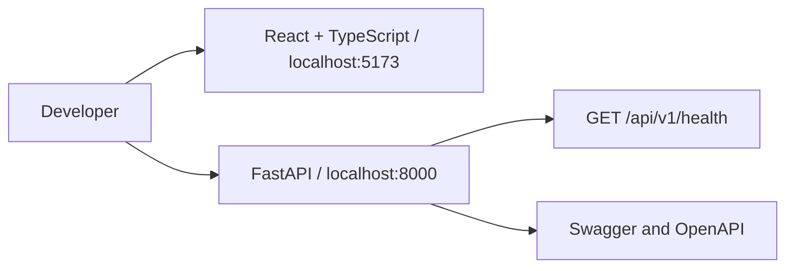
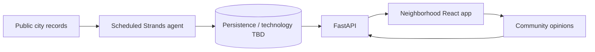

# Architecture and integration

## Implemented scaffold

The frontend and API run independently. There is no product-data connection yet.
Frontend owns presentation and interaction; backend will own persisted data,
authentication, voting rules, and agent execution. API credentials stay server-side.

## Planned product architecture — not implemented

The agent should detect new records, avoid duplicate processing, extract meetings
and legislation, connect them to neighborhoods and places, and prepare concise
source-linked analyses. Pros and cons should distinguish claims in sources from
model inference. Adopted law, proposals, official votes, and community opinions
must remain distinct. Uncertain items should surface for review.

Background execution, database selection, authentication, and deployment (including
possible AgentCore Runtime) are later decisions. This diagram describes intent,
not a working autonomous pipeline.

## Integration agreement

- API prefix: `/api/v1`.
- Current contract: `GET /health` under that prefix returns HTTP 200 with
  `{"status":"ok","service":"docket-api"}`.
- Source of truth for implemented endpoints: FastAPI's `/openapi.json`.
- Frontend development origin: `http://localhost:5173`.
- Reserved frontend environment variable: `VITE_API_BASE_URL`.
- Before implementing resource endpoints, agree on identifiers, pagination,
  error responses, timestamps, and source attribution. No product schemas are
  frozen in this scaffold.

## Hackathon work still required

Implement and demonstrate an end-to-end Strands workflow alongside the civic UI.
Prepare an architecture diagram matching the final system, setup instructions,
a public repository with its MIT license visible, submission text, and a demo
video of at most five minutes. Confirm final requirements against the hackathon
rules before submitting. A live demo and a public AWS Builder story are further
submission opportunities.
