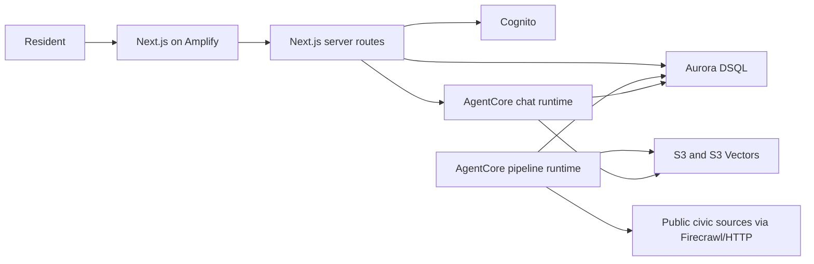

# Architecture and integration

## Implemented architecture

The frontend owns browser presentation. Its server routes own Cognito sessions,
membership, votes and reviews. `docket/` is the only Python backend and owns ingestion,
retrieval, cited generation and AgentCore runtimes. Credentials stay server-side.

## Runtime boundaries

- The web client never receives AWS credentials.
- The Next.js server invokes AgentCore chat with its SSR role.
- AgentCore pipeline work runs through a separate runtime and IAM policy.
- `docket/api/main.py` is a local fallback and protects generation/ingestion routes
  with `DOCKET_PIPELINE_API_TOKEN`; production pipeline calls use AgentCore.
- Aurora DSQL is the shared source of truth. The agent owns source documents,
  evidence and generated outputs; the web app owns members and civic participation.

## Hackathon work still required

Demonstrate the existing end-to-end Strands workflow alongside the civic UI.
Prepare an architecture diagram matching the final system, setup instructions,
a public repository with its MIT license visible, submission text, and a demo
video of at most five minutes. Confirm final requirements against the hackathon
rules before submitting. A live demo and a public AWS Builder story are further
submission opportunities.
